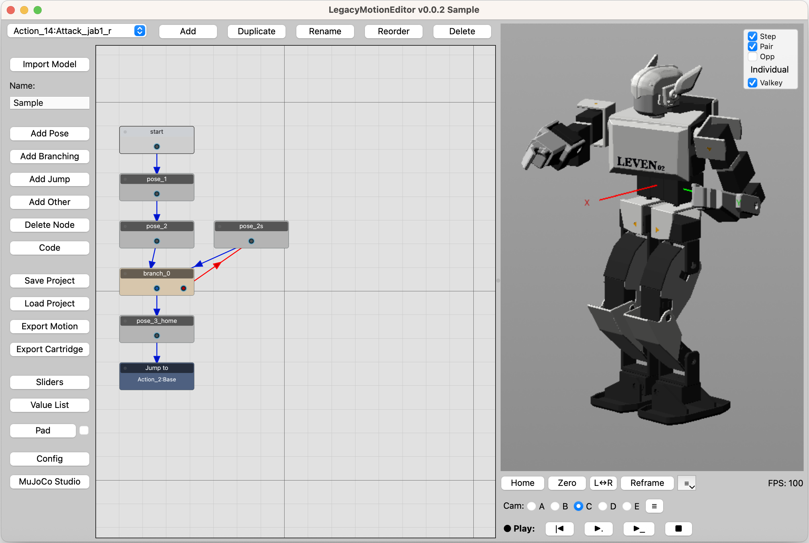
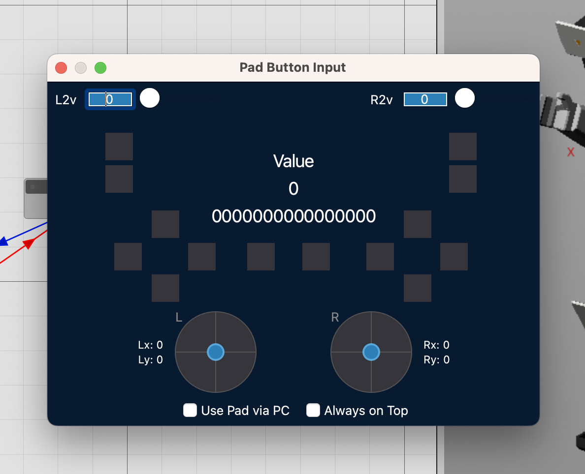
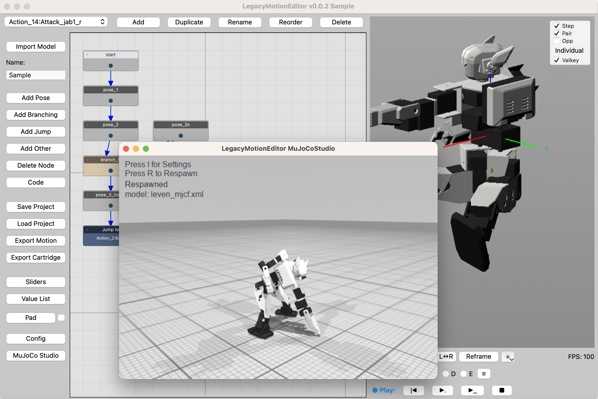

# LegacyMotionEditor

[English](README.md) | [日本語](README_jp.md)


**LegacyMotionEditor**(以下**LME**)は, ロボット向けの **ノードグラフ式モーションエディタ** です.   
URDF / MJCF モデルを読み込み, ポーズをノードグラフで時系列で組み立てることができます. 
3D プレビューによる直感的なポーズ作成に対応し, またMuJoCo物理シミュレータ上で動作をリアルタイム確認できるMuJoCoStudioを同梱しています. ゲームパッドでの操作にも対応しており, ロボットを自在に操作することもできます. 

**バージョン:** 0.0.2  
**作者:** Izumi Ninagawa  
**ライセンス:** MIT — Copyright (c) 2026 Izumi Ninagawa（[`LICENSE`](LICENSE) 参照）  
第三者パッケージは各自のライセンスのままです（PySide6: LGPL, pygame-ce: LGPL-2.1）. 
一部 [merimujoco](https://github.com/holypong/merimujoco/blob/main/README.md) を応用して作成しています

---



## ファイル構成

| ファイル | 役割 |
|---|---|
| `LegacyMotionEditor.py` | メインエディタ UI |
| `LegacyMotionEditor_Utils.py` | 共通ヘルパ・Pad モニタ・歩行ランタイム |
| `LegacyMotionEditor_MuJoCoStudio.py` | Valkey → MuJoCo の軽量プレビュー |
| `LegacyMotionEditor_CodeEditor.py` | ProjectCode インラインエディタ |
| `LegacyMotionEditor_Importer.py` | URDF / MJCF インポータ |
| `RobotLabelBridge.py` | 関節 / リンク名の一般化 |
| `requirements.txt` | Python 依存パッケージ |

---

## 必要環境

- **Python 3.10 以上**

| 区分 | パッケージ |
|---|---|
| エディタ本体 | `numpy`, `Qt.py`, `PySide6`, `vtk`, `NodeGraphQt`, `trimesh`, `pycollada` |
| 任意: Valkey 連携 | `valkey` |
| 任意: Pad / MuJoCo Studio | `pygame-ce`, `mujoco` |

---

## インストールと起動

[`uv`](https://docs.astral.sh/uv/) を推奨します. 

```bash
# uv のインストール（初回のみ）
curl -LsSf https://astral.sh/uv/install.sh | sh

# venv 作成と依存インストール
cd LegacyMotionEditor
uv venv --python 3.11
source .venv/bin/activate          # Windows: .venv\Scripts\activate
uv pip install -r requirements.txt
export QT_PREFERRED_BINDING=PySide6   # Windows: set QT_PREFERRED_BINDING=PySide6
```

### pip での代替

```bash
python3 -m venv .venv
source .venv/bin/activate
pip install -r requirements.txt
export QT_PREFERRED_BINDING=PySide6
```

### Valkey のインストール

Valkeyを使用することで, 物理シミュレータMuJoCo上でのモーション再生が可能になります. 

> 公式ドキュメント: https://valkey.io/docs/installation/

```bash
# macOS（Homebrew）
brew install valkey
valkey-server          # 起動（デフォルトポート 6379）

# Ubuntu / Debian
sudo apt install valkey-server
sudo systemctl start valkey

# Windows（Docker 推奨）
docker run -d -p 6379:6379 valkey/valkey

# pip パッケージ（Python クライアント）
pip install valkey
```

LME のデフォルト接続先は `127.0.0.1:6379` です. 変更する場合は MuJoCo Studio の Settings（`I` キー）から設定してください. 

### 起動

```bash
python LegacyMotionEditor.py
```

---

## Getting Started

1. 左側メニューのLoad ProjectでsaveディレクトリにあるLME_sample_save.xmlを読み込みます. 
2. 上部のActionプルダウンから任意のアクションを選択します. 
3. 任意のPoseノードをダブルクリックし, スライダーで関節を操作できることを確認します. 
4. 3Dビューからも関節を操作できることを確認します. 
5. 3Dビュー右上の「Valkey」をチェックします. インメモリデータベースに関節データがストリーミングされます. 
6. 3Dビュー下の「▶︎_」ボタンを押してモーション全体を再生します. 
7. 左側メニューで「MuJoCo Studio」を推し, MuJoCoStudioを開きます. 
8. Padボタンを押し, GamePadウィンドウを表示します. 
9. Padのボタンの十字キー下を押すと反応し, MuJoCo上のロボットが動きます. 

---

## 機能一覧

### アクション
画面左上のプルダウンで, アクションを選択できます. 
アクションは複数のポーズを束ねたモーションの1単位です. 
モーション間はJumpノードにより遷移できます. 
特に起動直後のアクションは「Boot」, ループの起点となるアクションを「Base」としています. 

### ノードグラフ
アクション内のポーズの時系列をノードで表現します. 
ノードをドラックすることで接続ラインが出るので, 次のノードに接続します. 
再生は接続順に行われます. 

| ノード種別 | 内容 |
|---|---|
| **Pose** | 1 フレームの関節角度スナップショット |
| **Define** | 変数定義（共通姿勢や定数を名前付きで保持） |
| **Branching** | UserVal / Pad 値で左右分岐 |
| **Command** | 再生制御コマンドの挿入 |
| **Mix** | 関節角度に補正値をブレンド |
| **Jump** | 任意のアクションや関数にジャンプ |
| **Code (ProjectCode)** | Python スニペットによるカスタム処理（Walk IK など） |

- ノードのダブルクリックで名前変更・詳細編集
- ノード右クリックで削除 / 複製 / 接続操作

---

### 3D ビュー

- STL / MJCF モデルをリアルタイムで表示します
- 関節ドラッグで姿勢を直接操作できます
- **Home** — ポーズをホームポジション（Configで設定）にします
- **Zero** — 全関節をゼロ角度にリセットします
- **L↔R** — 左右の関節角度を入れ替えます
- **Reframe** — カメラ視点をリセットします
- **≡** 上半身/下半身のみをホームポジションにします

---

### Joint Sliders（関節スライダ）
- ノードのダブルクリックで関節スライダウィンドウが表示されます
- 全関節の角度をスライダや数値入力で設定できます
- **Step** — 関節の移動を指定角度ごとに移動
- **Pair** モード — 左右対称に同時変更
- **Opp** モード — 左右を逆向きに同時変更
- **Group** プリセット — 関節グループ（上半身 / 下半身 etc.）の切り替え
- **Easing** — フレーム間補間の種類を個別または一括設定

---

### 再生・Walk Controller

- 「|◀︎」再生ヘッドをアクション先頭へ / 「▶︎.」アクションを再生 / 「▶︎_」アクション遷移あり再生 /「■」停止
- 再生中は 3D ビューと Valkey ストリームをリアルタイム更新
- **ProjectCode** 内に Walk IK (`walk_ik_step`) を記述することで歩行モーションを実装可能
- Pad（ゲームパッド）入力で分岐・加速・停止などのランタイム制御

---

### プロジェクト保存 / 読込

- **Save Project** — ノードグラフ・関節データ・ロボット名を XMLで保存
- **Load Project** — 保存 XML からフル復元（ロボット名・ノード位置・接続も含む）
- **Export Motion** — モーションデータを別フォーマットへエクスポート（未実装）
- **Export Cartridge** — PhysialOn向けロジックカートリッジをき出し
- 終了時にセッション状態を自動保存 (`save/_lme_session.xml`)

---

### Valkey ストリーミング

- 編集・再生中の関節角度を [Valkey](https://valkey.io/)（Redis 互換）経由でリアルタイム送信
- MuJoCo Studio や物理ロボット (`PhysicalOn`) がサブスクライバとして受信
- 3D ビュー右上の **Valkey** チェックで送信 ON/OFF

---

### Pad Monitor（ゲームパッド）

- **Pad** ボタンでゲームパッドモニタを開く（pygame-ce 必須）
- ボタン / スティック入力を `Pad_*` / `UserVal_*` として Branching ノードの条件に利用
- チェックボックスで PC Pad の常時監視を ON/OFF



---

### MuJoCo Studio

- **MuJoCo Studio** ボタンで `LegacyMotionEditor_MuJoCoStudio.py` を別プロセスで起動
- Valkey 経由の角度ストリームを MuJoCo 物理シミュレータ上でリアルタイム表示
- テストグリッド付き軽量シーンを内蔵

---

### Config

- **Config** ボタンで詳細設定ダイアログを開く
- Undo 履歴の上限数, デバッグログ出力, Valkey 接続先などを設定



---

### ショートカット

- `Ctrl+Z` / `Ctrl+Y` / `Ctrl+Shift+Z` でUndo / Redo
- `Ctrl+C`/ `Ctrl+V`/ `Ctrl+D` でノードのコピー/ ペースト / 複製
- `Del`/ 選択したノードの削除

---

## RobotLabelBridge

`RobotLabelBridge.py` は, ロボットの joint / link 名を **カノニカル短名**（例: `l_knee_yp`）へ統一するモジュールです.   
LME から読み込み済みモデルの一括リネームに利用できます. 
モジュール単体でも起動, 使用することができます. 
（詳細は別途リポジトリで解説予定です）
